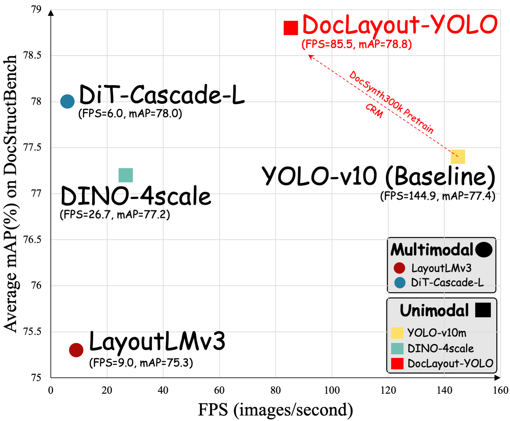
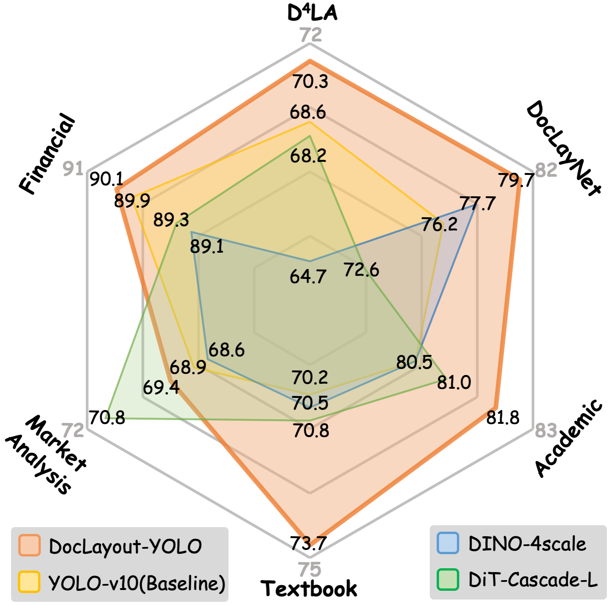
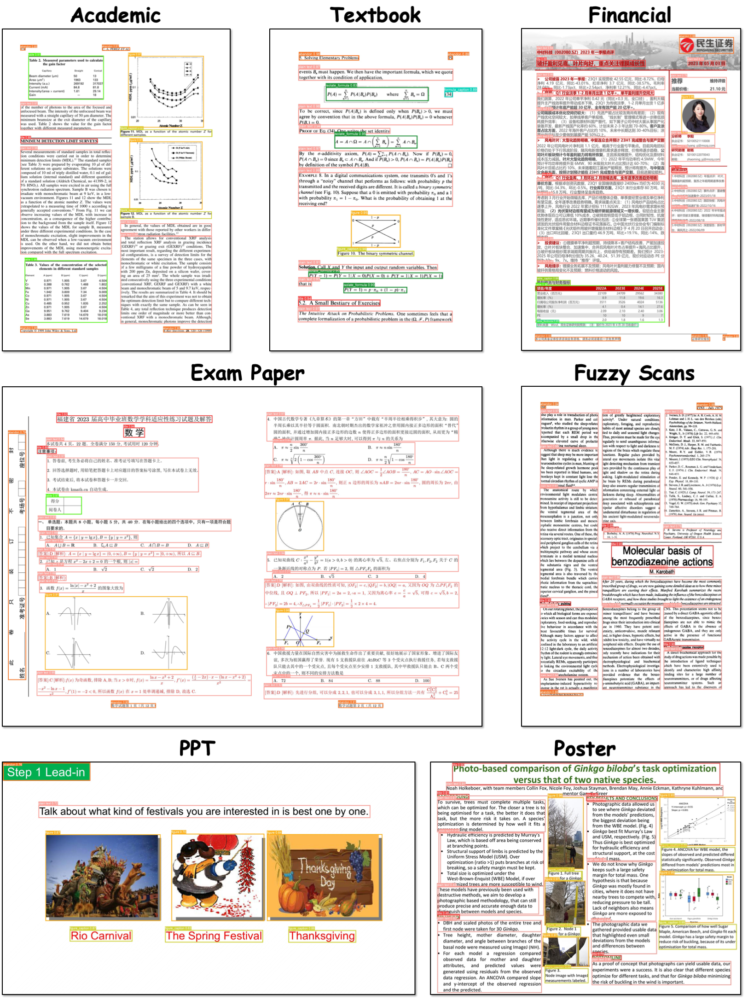
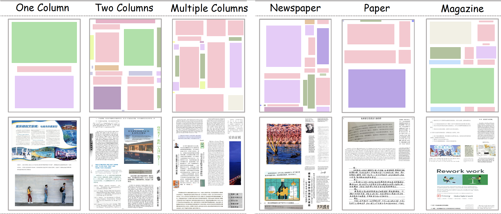

<div align="center">

[English](./README.md) | 简体中文


<h1>DocLayout-YOLO: Enhancing Document Layout Analysis through Diverse Synthetic Data and Global-to-Local Adaptive Perception</h1>

欢迎来到[DocLayout-YOLO](https://arxiv.org/abs/2410.12628)官方仓库，针对多样性文档提供高质量布局检测能力。

[](https://arxiv.org/abs/2410.12628) [](https://huggingface.co/spaces/opendatalab/DocLayout-YOLO) [](https://huggingface.co/collections/juliozhao/doclayout-yolo-670cdec674913d9a6f77b542)

</div>

## 摘要

> 我们提出DocLayout-YOLO的基于YOLO-v10，通过提供多样性文档预训练及适配文档检测的模型结构优化，可针对多样性文档进行实时鲁棒的检测。在文档预训练阶段，我们提出Mesh-candidate BestFit，将文档合成视为二维装箱问题，合成类型多样性的大规模合文档数据集DocSynth-300K。在模型结构优化方面，我们提出了全局到局部可控的感知模块，确保在尺度变化不一的文档元素上得到精准检测结果。


<p align="center">
  
   <br>
</p>

## 新闻 🚀🚀🚀

**2024.10.25** 🎉🎉  基于**Mesh-candidate Bestfit**的数据合成代码开源，可以合成类型多样、真实感强的高质量布局检测数据集，使用教程以及样例数据请见[详情](./mesh-candidate_bestfit)。

**2024.10.23** 🎉🎉  **DocSynth300K数据集** 现在已经上线 [🤗Huggingface](https://huggingface.co/datasets/juliozhao/DocSynth300K), DocSynth300K是一个多样性大规模文档布局检测预训练合成数据集，和from scratch训练相比可以大幅提升下游微调性能。

**2024.10.21** 🎉🎉  **在线演示**上线[🤗Huggingface](https://huggingface.co/spaces/opendatalab/DocLayout-YOLO)。

**2024.10.18** 🎉🎉  DocLayout-YOLO接入文档内容提取工具包**[PDF-Extract-Kit](https://github.com/opendatalab/PDF-Extract-Kit)**。

**2024.10.16** 🎉🎉  论文上线[ArXiv](https://arxiv.org/abs/2410.12628)。  


## 快速使用

[在线演示](https://huggingface.co/spaces/opendatalab/DocLayout-YOLO)目前已经上线。 对于本地开发部署，参考以下步骤:

### 1. 环境配置

参考以下步骤配置环境:

```bash
conda create -n doclayout_yolo python=3.10
conda activate doclayout_yolo
pip install -e .
```

**注意:** 如果只想使用DocLayout-YOLO的推理功能，直接通过```pip```进行安装:

```bash
pip install doclayout-yolo
```

### 2. 模型推理

可以通过脚本的方式或者SDK的方式进行推理:

- **脚本推理**

  通过以下命令运行推理脚本```demo.py```来进行推理:

  ```bash
  python demo.py --model path/to/model --image-path path/to/image
  ```

- **SDK推理**

  直接通过SDK进行模型推理:

  ```python
  import cv2
  from doclayout_yolo import YOLOv10

  # Load the pre-trained model
  model = YOLOv10("path/to/provided/model")

  # Perform prediction
  det_res = model.predict(
      "path/to/image",   # Image to predict
      imgsz=1024,        # Prediction image size
      conf=0.2,          # Confidence threshold
      device="cuda:0"    # Device to use (e.g., 'cuda:0' or 'cpu')
  )

  # Annotate and save the result
  annotated_frame = det_res[0].plot(pil=True, line_width=5, font_size=20)
  cv2.imwrite("result.jpg", annotated_frame)
  ```


请使用在 **DocStructBench** 上微调的模型来进行推理, **可以适用于实际场景中多种类型文档**。模型下载地址在[链接](https://huggingface.co/juliozhao/DocLayout-YOLO-DocStructBench/tree/main)， 示例图像路径为 ```assets/example```。

<p align="center">
   <br>
</p>


**注意:** 对于PDF或者文档内容提取，请参考[PDF-Extract-Kit](https://github.com/opendatalab/PDF-Extract-Kit/tree/main)和[MinerU](https://github.com/opendatalab/MinerU)。

**注意:** 感谢[NielsRogge](https://github.com/NielsRogge)，DocLayout-YOLO 现在支持直接从 🤗Huggingface 进行调用, 加载模型示例如下:

```python
filepath = hf_hub_download(repo_id="juliozhao/DocLayout-YOLO-DocStructBench", filename="doclayout_yolo_docstructbench_imgsz1024.pt")
model = YOLOv10(filepath)
```

或者直接通过 ```from_pretrained``` 进行加载:

```python
model = YOLOv10.from_pretrained("juliozhao/DocLayout-YOLO-DocStructBench")
```

更多相关细节可以在这个[PR](https://github.com/opendatalab/DocLayout-YOLO/pull/6)进行查看。

**注意:** 感谢[luciaganlulu](https://github.com/luciaganlulu)，DocLayout-YOLO可以进行batch推理。具体来说，在```model.predict```的```demo.py```函数中传入**图像路径的列表**，而不是单张图像，除此之外由于```YOLOv11```之前版本不支持batch推理，需要手动修改[此处](doclayout_yolo/engine/model.py#L431)的```batch_size```值。

## DocSynth300K数据集

<p align="center">
  
</p>

### 数据下载

使用以下指令下载数据集（约113G）:

```python
from huggingface_hub import snapshot_download
# Download DocSynth300K
snapshot_download(repo_id="juliozhao/DocSynth300K", local_dir="./docsynth300k-hf", repo_type="dataset")
# If the download was disrupted and the file is not complete, you can resume the download
snapshot_download(repo_id="juliozhao/DocSynth300K", local_dir="./docsynth300k-hf", repo_type="dataset", resume_download=True)
```

### 数据准备 & 预训练

如果想要进行DocSynth300K预训练, 首先使用 ```format_docsynth300k.py``` 将原始数据集的 ```.parquet``` 格式转换成 ```YOLO``` 格式. 格式转换后的数据存储在 ```./layout_data/docsynth300k```。

```bash
python format_docsynth300k.py
```

使用此处 [命令](assets/script.sh#L2) 来进行DocSynth300K预训练。 默认使用8张GPU进行训练。 为了达到最好的性能, 可以通过调整预训练超参数例如 ```imgsz``` 以及 ```lr```， 根据下游微调数据集的分布或者训练设置来调整。

**注意:** 由于YOLO代码库数据加载存在内存泄漏问题，大数据集训练有可能会出现不明原因中断，可以通过 ```--pretrain 上一个检查点.pt --resume``` 来接续预训练


## 公开文档版面分析（DLA）数据集训练验证

### 数据准备

1. 指定数据根目录

找到```ultralytics```配置文件 (对于Linux用户配置文件在 ```$HOME/.config/Ultralytics/settings.yaml)```， 将```datasets_dir```改成项目根目录。

2. 下载整理好的YOLO格式D4LA以及DocLayNet数据， 放置在路径```./layout_data```并且解压缩:

| 数据集 | 下载 |
|:--:|:--:|
| D4LA | [链接](https://huggingface.co/datasets/juliozhao/doclayout-yolo-D4LA) |
| DocLayNet | [链接](https://huggingface.co/datasets/juliozhao/doclayout-yolo-DocLayNet) |

准备好的文件结构如下所示:

```bash
./layout_data
├── D4LA
│   ├── images
│   ├── labels
│   ├── test.txt
│   └── train.txt
└── doclaynet
    ├── images
    ├── labels
    ├── val.txt
    └── train.txt
```

### 模型训练验证

模型训练使用8张GPU，全局batch size大小为64（8张图片每个GPU）。其他详细的配置、命令、以及模型权重如下:

| 数据集 | 模型 | 是否DocSynth300K预训练？ | 图像尺寸 | 学习率 | 训练 | 验证 | AP50 | mAP | 模型权重 |
|:--:|:--:|:--:|:--:|:--:|:--:|:--:|:--:|:--:|:--:|
| D4LA | DocLayout-YOLO | &cross; | 1600 | 0.04 | [命令](assets/script.sh#L5) | [命令](assets/script.sh#L11) | 81.7 | 69.8 | [权重](https://huggingface.co/juliozhao/DocLayout-YOLO-D4LA-from_scratch) |
| D4LA | DocLayout-YOLO | &check; | 1600 | 0.04 | [命令](assets/script.sh#L8) | [命令](assets/script.sh#L11) | 82.4 | 70.3 | [权重](https://huggingface.co/juliozhao/DocLayout-YOLO-D4LA-Docsynth300K_pretrained) |
| DocLayNet | DocLayout-YOLO | &cross; | 1120 | 0.02 | [命令](assets/script.sh#L14) | [命令](assets/script.sh#L20) | 93.0 | 77.7 | [权重](https://huggingface.co/juliozhao/DocLayout-YOLO-DocLayNet-from_scratch) |
| DocLayNet | DocLayout-YOLO | &check; | 1120 | 0.02 | [命令](assets/script.sh#L17) | [命令](assets/script.sh#L20) | 93.4 | 79.7 | [权重](https://huggingface.co/juliozhao/DocLayout-YOLO-DocLayNet-Docsynth300K_pretrained) |

使用DocSynth300K预训练过的预训练模型可以从[这里](https://huggingface.co/juliozhao/DocLayout-YOLO-DocSynth300K-pretrain)进行下载。 验证时，将命令中的 ```checkpoint.pt``` 改成需要验证的模型。

## Star History

如果我们的项目有帮助到您，请给本项目点赞！您的点赞是我们继续探索优化的动力。

<picture>
  <source
    media="(prefers-color-scheme: dark)"
    srcset="
      https://api.star-history.com/svg?repos=opendatalab/DocLayout-YOLO&type=Date&theme=dark
    "
  />
  <source
    media="(prefers-color-scheme: light)"
    srcset="
      https://api.star-history.com/svg?repos=opendatalab/DocLayout-YOLO&type=Date
    "
  />
  
</picture>

## 致谢

代码基于[ultralytics](https://github.com/ultralytics/ultralytics) 以及 [YOLO-v10](https://github.com/lyuwenyu/RT-DETR)进行开发。

## 引用

```bibtex
@misc{zhao2024doclayoutyoloenhancingdocumentlayout,
      title={DocLayout-YOLO: Enhancing Document Layout Analysis through Diverse Synthetic Data and Global-to-Local Adaptive Perception}, 
      author={Zhiyuan Zhao and Hengrui Kang and Bin Wang and Conghui He},
      year={2024},
      eprint={2410.12628},
      archivePrefix={arXiv},
      primaryClass={cs.CV},
      url={https://arxiv.org/abs/2410.12628}, 
}

@article{wang2024mineru,
  title={MinerU: An Open-Source Solution for Precise Document Content Extraction},
  author={Wang, Bin and Xu, Chao and Zhao, Xiaomeng and Ouyang, Linke and Wu, Fan and Zhao, Zhiyuan and Xu, Rui and Liu, Kaiwen and Qu, Yuan and Shang, Fukai and others},
  journal={arXiv preprint arXiv:2409.18839},
  year={2024}
}

```
