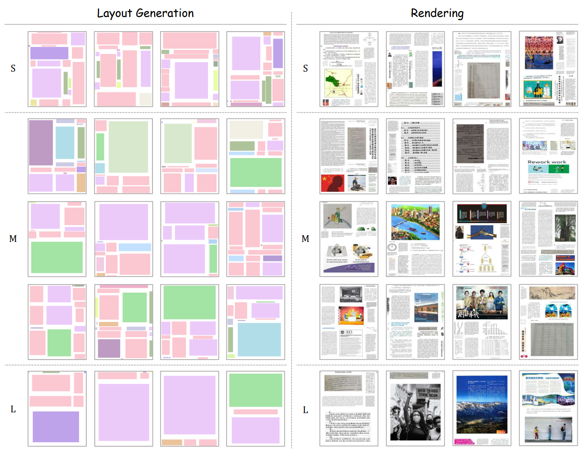

## Pretraining Data Generation via Mesh-candidate Bestfit

<p align="center">
   <br>
  <i><small>Mesh-candidate Bestfit iteratively inserts elements from a small set of public datasets by searching for the best match between sampled candidates and the available grids in the current layout, ultimately achieving document synthesis.</i>
</p>

You can generate a large scale of diverse data for pretraining applying our proposed method Mesh-candidate Bestfit, just follow steps below:

### 1. Environment Setup

You need to install [PyMuPDF](https://pypi.org/project/PyMuPDF/1.23.7/) for subsequent rendering via pip:

```bash
cd mesh-candidate_bestfit
pip install pymupdf==1.23.7
```

### 2. Preprocessing

- **Data Preparation**

  Two primary things need to be well prepared before starting generation: 

  1\. **Original Annotation File of Initial Dataset**   

     * The annotation file follows **COCO format**, a **JSON file** contains images and instances annotations.
     * Each instance should have a **unique** ```instance_id```.
     * The file should be placed under `./`.   

  2\. **Element Pool**  
  
  Element Pool is constructed according to annotation file. Specifically, crop all the instances images and organize them in a category-wise manner. The structure of element pool is as follows (folder is named by each category and cropped image is named by unique ```instance_id```):

  ```bash
  ./element_pool
  ├── advertisement
  │   ├── 727.jpg
  │   ├── 919.jpg
  │   ├── 1423.jpg
  │   └── ...
  ├── algorithm
  │   ├── 12653.jpg
  │   ├── 17485.jpg
  │   ├── 44364.jpg
  │   └── ...
  └── ...
  ```

  **Note:** For convenience, we provide original annotation file and element pool for M6Doc-test dataset, which can be downloaded from [annotation file](https://drive.google.com/file/d/1ua41Gs3UW8iuoJp21tZ4-lczVrcEm-gP/view?usp=sharing) and [element pool](https://drive.google.com/file/d/1MrIFObKr1bDGgZLBQM_c_Dvobkp6mjFE/view?usp=sharing), respectively. And you can run the script below to decompress the element pool properly:

  ```bash
  unzip /path/to/your/element_pool.zip -d ./element_pool/
  ```


- **Data Augmentation(Optional)**

  If you want to apply our designed augmentation pipeline to your element pool, you can just run:

  ```bash
  python augmentation.py --min_count 100 --aug_times 10
  ```

  The script will perform augmentation pipeline `aug_times` times on each element of categories whose element number is less than `min_count`. If you want to generate large amount of data, try larger `aug_times`. In contrast, you want to shorten this process, try smaller `aug_times`. During DocSynth300K generation, we use ```--aug_times 50```.

- **Map Dict**

  To facilitate the random selection of candidates during the rendering phase, it is necessary to establish a mapping from candidate elements to all of their candidate paths (passing ```--use_aug``` is augmentation is implemented):

  ```bash
  python map_dict.py --save_path ./map_dict.json --use_aug
  ```

### 3. Layout Generation

Now, you can generate diverse layouts using Mesh-candidate Bestfit algorithm. To prevent process blocking, it will save the result of each layout in a timely manner, but you can use the [combine_layouts.py](./combine_layouts.py) script to combine them all together like this:

```bash
python bestfit_generator.py --generate_num 100 --n_jobs 5 --json_path ./annotation_file.json --output_dir ./generated_layouts/seperate
python combine_layouts.py --seperate_layouts_dir ./generated_layouts/seperate --save_path ./generated_layouts/combined_layouts.json
```

Afterwards, feel free to delete the seperate layouts since they are no longer used.

**Note:** Due to multiprocessing used in layout generation, set proper ```--n_jobs``` to avoid process blocking.
    
### 4. Rendering

Finally, you can render generated layouts and save the results in yolo format via the script below:

```bash
python rendering.py --json_path ./generated_layouts/combined_layouts.json --n_jobs 5 --map_dict_path ./map_dict.json --save_dir ./generated_dataset 
```

### Visualization

We provide [visualize.ipynb](./visualize.ipynb) to visualize the layouts generated by our proposed methods. Here, we display some generation cases below:

<p align="center">
   <br>
</p>
